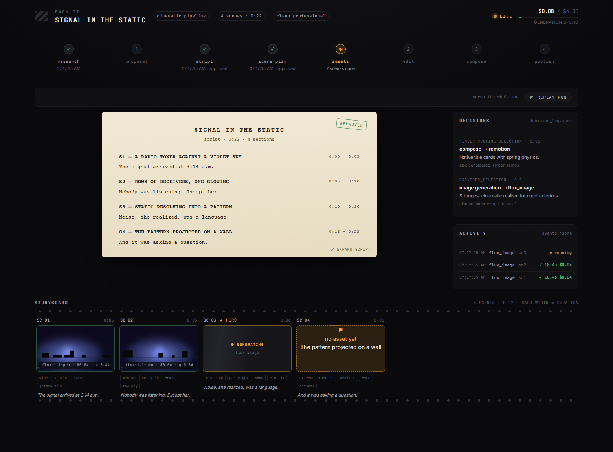
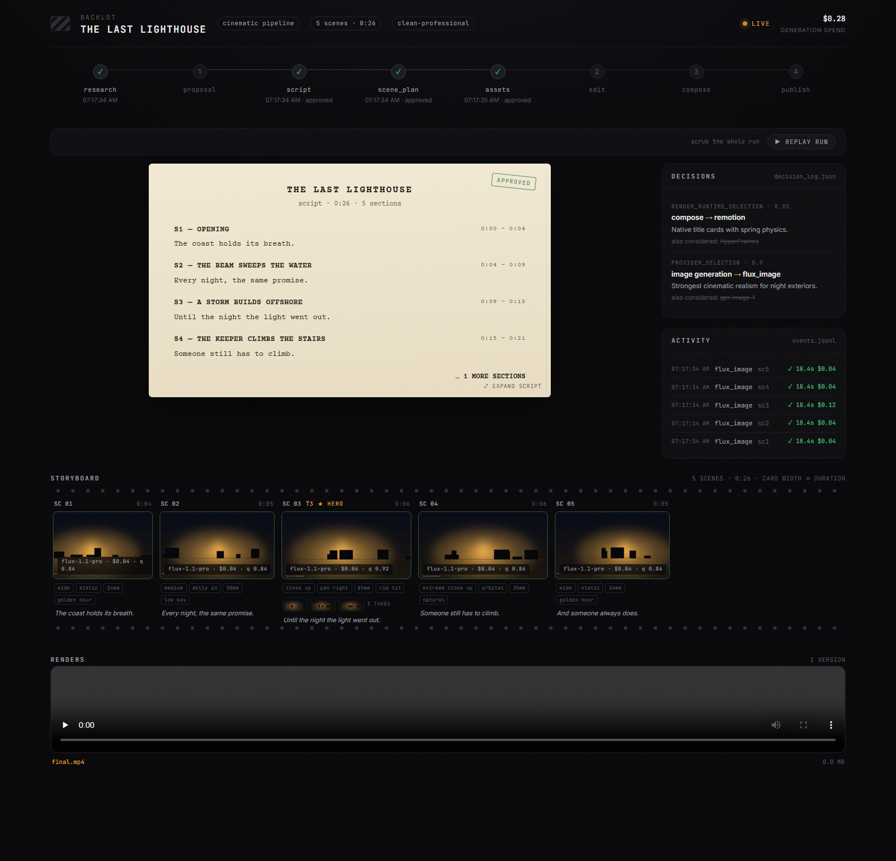
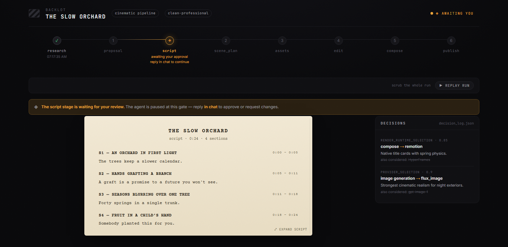
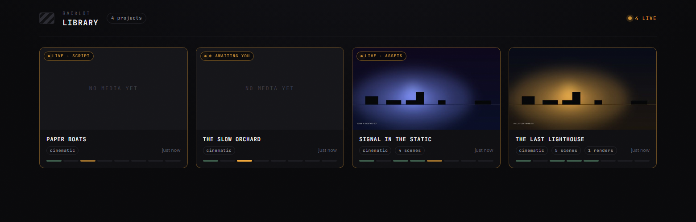

<p align="center">
  
</p>

<h1 align="center">Video Production Buddy / 织影</h1>

<p align="center"><strong>Open, governed AI video production: plan, approve, generate, compose, and verify before you spend.</strong></p>

<p align="center">
  <strong>English</strong> | <a href="README.zh-CN.md">简体中文</a>
</p>

<p align="center">
  <a href="#demos">🎬 Demos</a> &nbsp;·&nbsp;
  <a href="#why-it-is-different">✨ Why Different</a> &nbsp;·&nbsp;
  <a href="#how-it-works">🧭 How It Works</a> &nbsp;·&nbsp;
  <a href="#quick-start">⚡ Quick Start</a> &nbsp;·&nbsp;
  <a href="#capabilities">🧩 Capabilities</a> &nbsp;·&nbsp;
  <a href="#community-and-discussion">💬 Community</a> &nbsp;·&nbsp;
  <a href="#contributing">🤝 Contribute</a> &nbsp;·&nbsp;
  <a href="docs/PR_REVIEW_GUIDE.md">🔎 Review Guide</a> &nbsp;·&nbsp;
  <a href="#citation">📚 Citation</a> &nbsp;·&nbsp;
  <a href="#acknowledgements">🙏 Acknowledgements</a>
</p>

<p align="center">
  <a href="https://video-production-buddy.github.io"></a>
  <a href="LICENSE"></a>
</p>

<p align="center">
  
  
  
  
  
</p>

<p align="center">
  
</p>

---

Turn your AI coding assistant into a full video production studio. Describe what you want in plain language — your agent handles research, scripting, asset generation, editing, and final composition.

**Important distinction:** OpenMontage can make image-based videos, but it can also make a real **video video** for free/open-source workflows: the agent builds a corpus from free stock footage and open archives, retrieves actual motion clips, edits them into a timeline, and renders a finished piece. That is not the usual "animate a handful of stills and call it video" trick.

<div align="center">
  <video src="https://github.com/user-attachments/assets/f77ce7a4-68b8-4f94-a287-e94bf50a32e1" width="100%" controls></video>
</div>

> **"SIGNAL FROM TOMORROW"** — a cinematic sci-fi trailer fully produced through OpenMontage: concept, script, scene plan, Veo-generated motion clips, soundtrack, and Remotion composition.

<div align="center">
  <video src="https://github.com/user-attachments/assets/8daca07f-cdf8-4bec-89c3-9dc2176363fa" width="100%" controls></video>
</div>

> **"THE LAST BANANA"** — a 60-second Pixar-style animated short about a lonely banana who finds friendship with a kiwi. 6 Kling v3-generated motion clips (via fal.ai), Google Chirp3-HD narration, royalty-free piano music, TikTok-style word-level captions, and Remotion composition. Total cost: **$1.33**.

<div align="center">
  <video src="https://github.com/user-attachments/assets/e03b5d1f-1199-4093-9f31-a43aa9da2c68" width="100%" controls></video>
</div>

> **"The Library at Alexandria"** — a 70-second history elegy on what humanity lost in a single night. Five hand-authored scenes — an illuminated manuscript page, cascading scroll-tags, a Burning Counter ticking 700,000 → 0 inside a candle's flame, a charred vellum fragment with surviving Greek, and an empty void — set to OpenAI 'ash' narration and a free Pixabay strings score. Total cost: **$0.02**. Built through OpenMontage's atelier (bespoke) composition mode — every scene crafted from scratch, no shared components.

<div align="center">
  <video src="https://github.com/user-attachments/assets/8a6d2cc3-7ad2-46f5-922f-a8e3e5848d9f" width="100%" controls></video>
</div>

> **"VOID — Neural Interface"** — a product ad produced with just one API key (OpenAI). 4 AI-generated images (gpt-image-1), TTS narration, auto-sourced royalty-free music, word-level subtitles via WhisperX, and Remotion data visualizations. Total cost: **$0.69**. Zero manual asset work.

<div align="center">
  <video src="https://github.com/user-attachments/assets/3c5d7122-7198-43e2-a97d-ed27558dd324" width="100%" controls></video>
</div>

> **"Afternoon in Candyland"** — a Ghibli-style anime animation. A little girl's whimsical afternoon adventure through candy gates, gumdrop rivers, and lollipop gardens. 12 FLUX-generated images with multi-image crossfade, cinematic camera motion (zoom, pan, Ken Burns), sparkle/petal/firefly particle overlays, and ambient music with auto-detected energy offset. Total cost: **$0.15**. No video generation, no manual editing.

<div align="center">
  <video src="https://github.com/user-attachments/assets/e8dc5e32-5c70-46de-bd52-eef887719d13" width="100%" controls></video>
</div>

> **"Mori no Seishin"** — a Ghibli-style anime animation of a forest spirit's journey through ancient woods. 12 FLUX-generated images with parallax crossfade, drift and pan camera motion, firefly and petal particles, cinematic vignette lighting, and ambient forest soundtrack. Total cost: **$0.15**. Still images brought to life through Remotion's animation engine.

<p align="center">
  <a href="https://www.youtube.com/@OpenMontage?sub_confirmation=1"><strong>Subscribe to @OpenMontage on YouTube</strong></a> to see new videos as they ship — every video includes the full prompt, pipeline, tools used, and cost so you can reproduce it yourself.
</p>

---

## Start From A Video You Already Love

Starting from a reference video is often faster than starting from a blank prompt.

OpenMontage can start from a **YouTube video, Short, Reel, TikTok, or local clip** and turn it into a grounded production plan:

1. **Paste a reference video**
2. **The agent analyzes transcript, pacing, scenes, keyframes, and style**
3. **You get 2-3 differentiated concepts, an honest tool path, cost estimates, and a sample before full production**

```text
"Here's a YouTube Short I love. Make me something like this, but about quantum computing."
```

What you get back is not "best guess prompt spaghetti." You get:

- **What it keeps** from the reference: pacing, hook style, structure, tone
- **What it changes**: topic, visual treatment, angle, narration approach
- **What it will cost** at your target duration, before asset generation starts
- **What it will actually look like** with your currently available tools

Works with **Claude Code, Cursor, Copilot, Windsurf, Codex** — any AI coding assistant that can read files and run code.

---

## Watch It Happen — The Backlot Living Storyboard

Chat tells you what the agent *said*. **Backlot shows you what the production is actually doing** — a local board that fills itself in as the pipeline runs. Stages light up, the script lands as a screenplay page, scene cards shimmer while assets generate, and every provider decision and dollar spent is on the wall.

When a production starts, the agent opens it for you automatically. No setup, no reporting — the board derives everything from the project files the pipeline already writes.

<p align="center"></p>

**The storyboard is now a real approval gate.** Asset generation pauses on a scene-by-scene contact sheet — takes, prompts, per-asset cost, quality scores — so you approve the visuals *before* the render, not after it's too late:

<p align="center"></p>

Creative gates hold until you answer. The board shows what's waiting and why; you reply in chat:

<p align="center"></p>

Every production on your machine, live-first, in the library:

<p align="center"></p>

```bash
python -m backlot open                  # the library — every project on disk
python -m backlot open <project-id>     # one production's live board
python scripts/backlot_simulate_run.py  # no production yet? watch a simulated one live
```

And when a run is done, hit **▶ REPLAY RUN** — the whole production replays from its timestamps, scrubbable end to end. See [`backlot/README.md`](backlot/README.md) for how it works.

---

## Quick Start

### Prerequisites

- **Python 3.10+** — [python.org](https://www.python.org/downloads/)
- **FFmpeg** — `brew install ffmpeg` / `sudo apt install ffmpeg` / [ffmpeg.org](https://ffmpeg.org/download.html)
- **Node.js 18+** — [nodejs.org](https://nodejs.org/)
- **An AI coding assistant** — Claude Code, Cursor, Copilot, Windsurf, or Codex

### Install & Run

```bash
git clone https://github.com/calesthio/OpenMontage.git
cd OpenMontage
make setup
```

Open the project in your AI coding assistant and tell it what you want:

```
"Make a 60-second animated explainer about how neural networks learn"
```

Or if you want the real-footage path:

```text
"Make a 75-second documentary montage about city life in the rain. Use real footage only, no narration, elegiac tone, with music."
```

That's it. The agent researches your topic with live web search, generates AI images, writes and narrates the script with voice direction, finds royalty-free background music automatically, burns in word-level subtitles, and renders the final video. Before you see anything, the system runs a multi-point self-review — ffprobe validation, frame sampling, audio level analysis, delivery promise verification, and subtitle checks. Every provider selection is scored across 7 dimensions with an auditable decision log. Every creative decision gets your approval.

> **No `make`?** macOS/Linux: `python3 -m venv .venv && source .venv/bin/activate && python -m pip install -r requirements.txt && cd remotion-composer && npm install && cd .. && python -m pip install piper-tts && cp .env.example .env`
>
> Windows PowerShell: `py -3 -m venv .venv; .\.venv\Scripts\Activate.ps1; python -m pip install -r requirements.txt; cd remotion-composer; npm install; cd ..; python -m pip install piper-tts; Copy-Item .env.example .env`
>
> **Agent-first by design:** the AI assistant is the producer and orchestrator, while skills and Python tools handle concrete work such as provider routing, media analysis, generation, composition, validation, checkpointing, and cost tracking.
>
> **Best first try:** run the zero-key demo, confirm your machine can render locally, then open this folder in your AI assistant and paste a starter prompt. Cloud API keys are optional until you want provider-generated images, video, voice, or music.
>
> <p align="center"><strong>⭐ Star this project if you want an open, inspectable alternative to black-box AI video generation, thank you!</strong></p>

## Demos

<div align="center">
  <video src="https://github.com/user-attachments/assets/df481a12-a150-41c6-97fe-24afcbeb85db" width="100%" controls></video>
</div>

> **织影 product ad** - a guided assistant flow for intake, proposal gates, asset generation, composition, and final review before delivery.

<div align="center">
  <video src="https://github.com/user-attachments/assets/c240b2d1-5c65-41f1-8d71-454ae1f43f51" width="100%" controls></video>
</div>

> **MacBook Air ad** - "Please help me design an ad video for MacBook Air."

## Why It Is Different

- 🎬 **Not prompt-to-video. Pipeline-to-video.** YAML manifests and director skills guide each stage from intake to publish.
- 💬 **Needs are discovered, not guessed.** Chat and GenUI gates help uncover the audience, taste, emotion, constraints, and ideal video profile in the user's mind.
- 🧠 **Design before asset generation.** Hot-topic search, Bilibili/Douyin-style viral analysis, professional video knowledge retrieval, and emotion-curve checks shape the plan while it is still cheap to revise.
- 🧷 **Consistency before generation.** Concept maps and approved constraints keep products, characters, scenes, and visual logic aligned across segments.
- 🛡️ **Hallucination review.** Review agents use policies and few-shot cases to catch unsafe, physically implausible, value-conflicting, or story-breaking samples before approval.
- ✅ **Human approval before expensive generation.** Briefs, proposals, scripts, scene plans, samples, and final renders can be reviewed before the next spend.
- 🔀 **Provider-aware execution.** Image, video, voice, music, stock, subtitle, analysis, and composition tools are discovered from the live registry and routed by task fit.
- 🧾 **Checkpointed and reproducible.** JSON artifacts, decision logs, and checkpoints preserve the production trail so work can be reviewed or resumed.
- 🧪 **Verified output.** Scene fidelity, product consistency, provider consistency, render validation, and post-render review keep the final video accountable to the approved brief.

# Music:
SUNO_API_KEY=your-key          # Full songs, instrumentals, any genre

# Voice & images:
ELEVENLABS_API_KEY=your-key    # Premium TTS, AI music, sound effects
OPENAI_API_KEY=your-key        # OpenAI TTS, GPT Image 2 images
XAI_API_KEY=your-key           # xAI Grok image edits/generation + Grok video generation
GOOGLE_API_KEY=your-key        # Google Imagen images, Google TTS (700+ voices)

# More video providers:
HEYGEN_API_KEY=your-key        # HeyGen — VEO, Sora, Runway, Kling via single gateway
RUNWAY_API_KEY=your-key        # Runway Gen-4 direct
```

<details>
<summary><strong>Have a GPU? Unlock free local video generation</strong></summary>

```bash
make install-gpu

# Then add to .env:
VIDEO_GEN_LOCAL_ENABLED=true
VIDEO_GEN_LOCAL_MODEL=wan2.1-1.3b  # or wan2.1-14b, hunyuan-1.5, ltx2-local, cogvideo-5b
```

</details>

---

## What You Get With Zero API Keys

You don't need paid API keys to make real videos. Out of the box, `make setup` gives you:

| Capability | Free Tool | What It Does |
|-----------|-----------|-------------|
| **Narration** | Piper TTS | Free offline text-to-speech — real human-sounding narration |
| **Open footage** | Archive.org + NASA + Wikimedia Commons | Free/open archival footage, educational media, and documentary texture |
| **Extra stock** | Pexels + Unsplash + Pixabay | Free stock footage/images (developer keys are free to get) |
| **Composition (React)** | Remotion | React-based rendering — spring-animated image scenes, text cards, stat cards, charts, TikTok-style word-level captions, TalkingHead |
| **Composition (HTML/GSAP)** | HyperFrames | HTML/CSS/GSAP rendering — kinetic typography, product promos, launch reels, registry blocks, website-to-video, rigged SVG character animation |
| **Post-production** | FFmpeg | Encoding, subtitle burn-in, audio mixing, color grading |
| **Subtitles** | Built-in | Auto-generated captions with word-level timing |

OpenMontage picks between Remotion and HyperFrames at proposal time (locked as `render_runtime`). Remotion is the default for data-driven explainers and anything using the existing React scene stack; HyperFrames is the default for motion-graphics-heavy briefs that express naturally as HTML + GSAP, including the `character-animation` pipeline's SVG/GSAP rig output. See `skills/core/hyperframes.md` for the full decision matrix.

**Two free-ish paths:**

- **Image-based video:** Piper narrates your script, images provide the visuals, and Remotion animates them into a polished edit.
- **Local character animation:** SVG rigs, pose libraries, GSAP timelines, and HyperFrames render cartoon character acting to `projects/<project-name>/renders/final.mp4`.
- **Real-footage video:** the documentary montage pipeline builds a CLIP-searchable corpus from Archive.org, NASA, Wikimedia Commons, and optional free-key sources like Pexels and Unsplash, then cuts together actual motion footage into a finished video.

If you want the second one, prompt for a **documentary montage**, **tone poem**, or **stock-footage collage**, and explicitly say **use real footage only**.

---

## Try These Prompts

Copy any of these into your AI coding assistant after setup. Each one runs a full production pipeline.

### Start from a reference video

> "Here's a YouTube short I love. Make me something like this, but about CRISPR for high school students."

> "Analyze this Reel and give me 3 original variants I could make for my own product launch."

> "I like the pacing and hook in this video. Keep that energy, but turn it into a 45-second explainer about black holes."

### Zero keys needed

> "Make a 45-second animated explainer about why the sky is blue"

> "Create a 60-second video about the history of the internet, with narration and captions"

> "Make a data-driven explainer about coffee consumption around the world"

### Free real-footage documentary path

> "Make a 90-second documentary montage about what a city feels like at 4am. Use real footage only, no narration, elegiac tone."

> "Create a 60-second Adam-Curtis-style archival collage about 1950s consumer optimism. Prefer Archive.org and Wikimedia footage."

> "Cut together a dreamlike montage about coming home in the rain using real stock footage only. Music yes, narration no."

### With an image/video provider configured (~$0.15–$1.50)

> "Create a 30-second Ghibli-style animated video of a magical floating library in the clouds at golden hour"

> "Make a 30-second anime-style animation of an underwater temple with bioluminescent coral and ancient ruins"

> "Create an animated explainer about how CRISPR gene editing works, using AI-generated visuals"

> "Make a product launch teaser for a fictional smart water bottle called AquaPulse"

### Full setup (~$1–$3)

> "Create a cinematic 30-second trailer for a sci-fi concept: humanity receives a warning from 1000 years in the future"

> "Make a 90-second animated explainer about quantum computing for middle school students, with a fun narrator voice and custom soundtrack"

Want more? See the full **[Prompt Gallery](PROMPT_GALLERY.md)** for tested prompts with expected costs and output examples, or run `make demo` to render zero-key demo videos instantly.

---

## Pipelines

Each pipeline is a complete production workflow, from idea to finished video.

| Pipeline | What It Produces | Best For |
|----------|-----------------|----------|
| **Animated Explainer** | AI-generated explainer with research, narration, visuals, music | Educational content, tutorials, topic breakdowns |
| **Animation** | Motion graphics, kinetic typography, animated sequences | Social media, product demos, abstract concepts |
| **Avatar Spokesperson** | Avatar-driven presenter videos | Corporate comms, training, announcements |
| **Cinematic** | Trailer, teaser, and mood-driven edits | Brand films, teasers, promotional content |
| **Clip Factory** | Batch of ranked short-form clips from one long source | Repurposing long content for social media |
| **Documentary Montage** | Thematic montage cut from a CLIP-indexed corpus of free stock footage and open archives (Pexels, Archive.org, NASA, Wikimedia, Unsplash) | Video essays, mood pieces, retrieval-first B-roll edits, real-footage videos without paid generation APIs |
| **Hybrid** | Source footage + AI-generated support visuals | Enhancing existing footage with graphics |
| **Localization & Dub** | Subtitle, dub, and translate existing video | Multi-language distribution |
| **Podcast Repurpose** | Podcast highlights to video | Podcast marketing, audiogram videos |
| **Screen Demo** | Polished software screen recordings and walkthroughs | Product demos, tutorials, documentation |
| **Talking Head** | Footage-led speaker videos | Presentations, vlogs, interviews |

Every pipeline follows the same structured flow:

```
research -> proposal -> script -> scene_plan -> assets -> edit -> compose
```

Each stage has a dedicated **director skill** — a markdown instruction file that teaches the agent exactly how to execute that stage. The agent reads the skill, uses the tools, self-reviews, checkpoints state, and asks for human approval at creative decision points.

> **Web research is a first-class stage.** Before writing a single word of script, the agent searches YouTube, Reddit, Hacker News, news sites, and academic sources. It gathers data points, audience questions, trending angles, and visual references — then cites everything in a structured research brief. Your videos are grounded in real, current information, not hallucinated facts.

---

## Why OpenMontage?

Most AI video tools give you a single clip from a prompt. OpenMontage gives you an **end-to-end production pipeline** — the same structured process a real production team follows, automated by your AI agent.

Most "free AI video" stacks quietly mean "animate still images." OpenMontage can do that too, but it can also build a finished video from **real footage** pulled from free/open sources, ranked semantically, edited intentionally, and rendered as a proper timeline.

Edit your own talking-head footage. Generate a fully animated explainer from scratch. Cut a 2-hour podcast into a dozen social clips. Translate and dub your content into 10 languages. Build a cinematic brand teaser from stock footage and AI-generated scenes. **If a production team can make it, OpenMontage can orchestrate it.**

- **12 production pipelines** — explainers, talking heads, screen demos, cinematic trailers, animations, podcasts, localization, documentary montages, and more
- **52 production tools** — spanning video generation, image creation, text-to-speech, music, audio mixing, subtitles, enhancement, and analysis
- **400+ agent skills** — production skills, pipeline directors, creative techniques, quality checklists, and deep technology knowledge packs that teach the agent how to use every tool like an expert
- **Reference-driven creation** — paste a video you like and the agent turns it into a grounded, differentiated production plan instead of forcing you to invent the perfect prompt from scratch
- **Real-footage documentary creation without paid video models** — build actual edited videos from free/open motion footage and archival sources, not just Ken Burns over images
- **Live web research built in** — before writing a single word of script, the agent runs 15-25+ web searches across YouTube, Reddit, news sites, and academic sources to ground your video in real, current data
- **Both free/local AND cloud providers** — every capability supports open-source local alternatives alongside premium APIs. Use what you have.
- **No vendor lock-in** — swap providers freely. The scored selector ranks every provider across 7 dimensions (task fit, output quality, control, reliability, cost efficiency, latency, continuity) and picks the best match automatically.
- **Production-grade quality gates** — delivery promise enforcement blocks slideshow-looking renders, pre-compose validation catches broken plans before wasting GPU time, and mandatory post-render self-review (ffprobe + frame extraction + audio analysis) ensures the agent never presents garbage. Every provider choice, style decision, and fallback gets logged in an auditable decision trail.
- **Budget governance built in** — cost estimation before execution, spend caps, per-action approval thresholds. No surprise bills.

---

## How It Works

```text
User request
  -> Chat and GenUI clarify needs, audience, taste, and constraints
  -> AI assistant selects a pipeline manifest
  -> AI assistant reads the stage director skill
  -> Design intelligence gathers trends, references, and production knowledge
  -> Python tools execute concrete media work
  -> JSON artifacts and checkpoints preserve state
  -> Review gates validate creative and technical decisions
  -> Composition runtime renders the final video
  -> Post-render checks verify the output
```

Video Production Buddy has no Python orchestrator. The assistant follows readable contracts in YAML manifests and Markdown skills. The codebase provides tools, schemas, persistence, validation, and render runtimes.

For ads and commercial-style projects, the pipeline adds stronger pre-production: product positioning, professional video production knowledge retrieval, hot-topic search, Bilibili/Douyin-style viral analysis, emotion pacing constraints, concept-map consistency checks, sample approval, scene fidelity checks, product identity validation, hallucination review, and final consistency review.

## Quick Start

### Before You Start

For a first try, you **do not** need cloud API keys. Render the checked-in zero-key demo first, confirm local rendering works, then add cloud providers only when you need them.

You need:

- **Git** - [git-scm.com](https://git-scm.com/downloads). If you do not want Git yet, download the repository ZIP from GitHub and unzip it.
- **Python 3.10+** - [python.org](https://www.python.org/downloads/); on Ubuntu/Debian, run `sudo apt install python3-venv` if virtualenv creation fails
- **FFmpeg** - `brew install ffmpeg` / `sudo apt install ffmpeg` / `winget install --id Gyan.FFmpeg` / `choco install ffmpeg -y` / [ffmpeg.org](https://ffmpeg.org/download.html)
- **Node.js 22+** - required for Remotion, HyperFrames, and character-animation renders
- **Make** - on macOS run `xcode-select --install`; on Ubuntu/Debian run `sudo apt update && sudo apt install make`; on Windows install [Chocolatey](https://chocolatey.org/install), then run `choco install make -y` in Administrator PowerShell
- **An AI coding assistant** - Codex, Claude Code, Cursor, GitHub Copilot, Windsurf, or another assistant that can read files and run shell commands

On Windows, reopen PowerShell after installing Python, Node.js, FFmpeg, or Make so new `PATH` entries are visible.
If you downloaded the ZIP instead of using Git, skip the `git clone` line and `cd` into the unzipped folder.

### Check Prerequisites

First confirm these commands print version or help output.

macOS/Linux:

```bash
git --version
python3 --version
python3 -m venv --help >/dev/null
ffmpeg -version
node --version
npm --version
npx --version
make --version
```

Windows PowerShell:

```powershell
git --version
python --version
python -m venv --help > $null
ffmpeg -version
node --version
npm --version
npx --version
make --version
```

If a command is not found, install that tool, reopen your terminal, and check again.

### First Local Smoke Test

Run this once to prove your machine can install dependencies, inspect available runtimes, and render a local demo video without API keys.

macOS/Linux:

```bash
git clone https://github.com/video-production-buddy/video-production-buddy.git
cd video-production-buddy
python3 -m venv .venv
source .venv/bin/activate
make setup
python -m lib.agent_components install --profile default --frozen
make preflight
make demo
```

Windows PowerShell:

```powershell
git clone https://github.com/video-production-buddy/video-production-buddy.git
cd video-production-buddy
python -m venv .venv
Set-ExecutionPolicy -Scope Process -ExecutionPolicy Bypass -Force
.\.venv\Scripts\Activate.ps1
$env:PYTHON = "python"
make setup
python -m lib.agent_components install --profile default --frozen
make preflight
make demo
```

`Set-ExecutionPolicy` only changes the current PowerShell process so the virtualenv activation script can run. `$env:PYTHON = "python"` makes the Makefile use Python from the active virtualenv. Later, when you want API keys, copy `.env.example` to `.env` if `make setup` did not already create it.

| Provider | Type | Notes |
|----------|------|-------|
| **FLUX** | Cloud API | State-of-the-art quality |
| **Google Imagen** | Cloud API | Imagen 4 — high-quality, multiple aspect ratios |
| **Grok Imagine Image** | Cloud API | Strong image edits, style transfer, and multi-image compositing |
| **GPT Image 2** | Cloud API | OpenAI's image model |
| **Recraft** | Cloud API | Design-focused generation |
| **Local Diffusion** | Local GPU | Stable Diffusion, free |
| **Pexels** | Stock | Free stock images |
| **Pixabay** | Stock | Free stock images |
| **Unsplash** | Stock | Free stock images |
| **ManimCE** | Local | Mathematical animations |

- `make preflight` prints JSON with `composition_runtimes`, provider availability, and selectable model choices.
- `make models-list` prints model choices in a readable list.
- `make demo` renders local demo MP4 files under `projects/demos/renders/`.
- No cloud API key is required for that demo path.

After the demo works, open this repository folder in your AI assistant and see [Start With A Prompt](#start-with-a-prompt).

### Useful Check Commands

Re-run the local capability/provider summary anytime:

```bash
make preflight
```

List model choices without reading raw JSON:

```bash
make models-list
make models-list CAPABILITY=video_generation
```

If HyperFrames is unavailable, you can ignore it at first; the zero-key demo mainly relies on Remotion and FFmpeg.

Re-render the checked-in demo suite anytime:

```bash
make demo
```

The demo path uses local Remotion components and should not require cloud API keys. The first Remotion render may download Chrome Headless Shell, so allow several minutes on a normal laptop. Generated demo renders are written under `projects/demos/renders/`; the command exits nonzero if Remotion finishes without creating the expected MP4.

If something fails, stay in the same AI assistant session and ask it to inspect the command output, preflight result, OS, Python, Node.js, and FFmpeg versions. If it looks like a project bug or missing documentation, please open a [GitHub Issue](https://github.com/video-production-buddy/video-production-buddy/issues) with those details.

### Add API Keys

All keys are optional. Skip this for the first try; when you need cloud generation, add only the provider keys you plan to use in `.env`. `make setup` usually creates `.env`; if not, copy `.env.example` to `.env`.

```bash
FAL_KEY=your-key              # Image/video generation: FLUX, Recraft, Seedance, Kling, Veo, MiniMax video
DASHSCOPE_API_KEY=your-key    # Qwen speech, Wan video, Wanxiang image
ELEVENLABS_API_KEY=your-key   # TTS, music, sound effects
OPENAI_API_KEY=your-key       # OpenAI TTS and image generation
MINIMAX_API_KEY=your-key      # MiniMax music generation
PEXELS_API_KEY=your-key       # Optional: stock media
```

New to API keys? Follow [`docs/PROVIDERS.md#where-to-get-api-keys`](docs/PROVIDERS.md#where-to-get-api-keys) for official signup/key links and key-safety rules. Keep keys in `.env`; do not paste them into chat prompts, screenshots, issues, or committed files.

For the full provider list, pricing notes, model-choice guidance, and free-tier
guidance, see [`docs/PROVIDERS.md`](docs/PROVIDERS.md). `.env.example` now
groups API keys and optional model defaults together. Copy it to `.env`, add
the keys you use, then set optional `VPB_*` model defaults next to those keys.

After editing local `.env`, validate it:

```bash
make models-check ENV_FILE=.env
```

To see valid provider/model values for the keys you configured:

```bash
make models-list
make models-list CAPABILITY=video_generation
```

If you prefer a command-generated preview instead of editing `.env` manually:

```bash
make models-configure ENV_FILE=.env CAPABILITY=video_generation PRESET=fast DRY_RUN=1
make models-configure ENV_FILE=.env CAPABILITY=video_generation PRESET=fast YES=1
```

Explicit request/tool inputs still win over `.env` defaults.

Have an NVIDIA GPU and want local generation?

```bash
make install-gpu
```

Then set:

```bash
VIDEO_GEN_LOCAL_ENABLED=true
VIDEO_GEN_LOCAL_MODEL=wan2.1-1.3b
```

Other local model options include `wan2.1-14b`, `hunyuan-1.5`, `ltx2-local`, and `cogvideo-5b`.

### What Works With Zero API Keys?

Out of the box, the local path can still do useful work:

| Capability | Free/local tool | What it does |
|------------|-----------------|--------------|
| Narration | Piper TTS | Offline text-to-speech when installation succeeds. |
| Composition | Remotion | React-based animated scenes, title cards, charts, captions, and image motion. |
| Motion graphics | HyperFrames | HTML/CSS/GSAP video when Node.js 22+ and the runtime check pass. |
| Post-production | FFmpeg | Encoding, stitching, trimming, audio mixing, subtitle burn-in, and validation. |
| Demos | `make demo` | Renders the checked-in zero-key demo suite under `projects/demos/renders/`. |

- **Human approval gates are enforced, not suggested** — proposal, script, scene plan, generated assets, and publish all pause for your sign-off. The checkpoint writer rejects a "completed" gated stage without recorded approval, and every superseded checkpoint is archived so the audit trail (including gate transitions) survives revisions. Review happens visually on the [Backlot board](#watch-it-happen--the-backlot-living-storyboard).
- **Pre-compose validation** — blocks render if the delivery promise is violated (e.g. "motion-led" video with 80% still images), slideshow risk score is critical, or renderer family is missing. Catches broken plans before wasting GPU time.
- **Post-render self-review** — after every render, the runtime runs ffprobe validation, extracts frames at 4 positions to check for black frames and broken overlays, analyzes audio levels for silence and clipping, verifies the delivery promise was honored, and checks subtitle presence. If the review fails, the video is not presented.
- **Slideshow risk scoring** — 6-dimension analysis (repetition, decorative visuals, weak motion, shot intent, typography overreliance, unsupported cinematic claims) prevents "animated PowerPoint" outputs.
- **Source media inspection** — when users supply their own footage, the system probes every file (resolution, codec, audio channels, duration) and builds planning implications before a single creative decision is made. No hallucinating content from filenames.

### Start With A Prompt

Open the repository folder in your AI assistant and describe the video you want, for example:

```text
Make a 30-second video ad for a new coffee brand.
Target audience: office workers who need a calm afternoon reset.
Platform: TikTok or Instagram Reels.
Style: warm, modern, cinematic, not loud.
```

OpenClaw, Claude Code, Codex, and similar assistants generally use the repository's agent instructions to pick the right pipeline, inspect available tools, propose a plan, and wait for confirmation before major generation work. If your assistant does not automatically read the repo instructions, ask it to read `AGENT_GUIDE.md` first. If a provider is missing, it should offer a local fallback or explain which API key unlocks that path.

Useful starter prompts:

```text
Make a 45-second animated explainer about why the sky is blue.
```

```text
Make a 75-second documentary montage about city life in the rain.
Use real footage only, no narration, elegiac tone, with music.
```

```text
Here is a reference video I like. Keep the pacing and hook style,
but turn it into a 30-second product ad for my own app.
```

## Capabilities

| Area | What It Supports |
|------|------------------|
| 🎞️ Generated video | Topic-to-video, explainers, animations, cinematic teasers, product ads, and short-form social videos. |
| 💬 Interactive discovery | Chat and GenUI interfaces clarify the target audience, emotion, constraints, and ideal video profile before generation. |
| 📣 Ad production | Strategy, hot-topic search, Bilibili/Douyin-style viral analysis, professional production knowledge retrieval, product constraints, sample approval, and publish checks. |
| 🎥 Source footage | Talking-head edits, screen demos, podcast repurposing, clip extraction, localization, and hybrid videos. |
| 🧭 Reference-aware planning | Analyze a reference video or user-provided source media before designing the new output. |
| 🎭 Story control | Emotion pacing constraints check suspense, twists, emotional anchors, and story appeal before assets are generated. |
| 🧩 Consistency control | Concept maps and approved design constraints keep product identity, characters, scenes, and visual logic consistent across segments. |
| 🔀 Provider routing | Select among configured image, video, voice, music, stock, subtitle, analysis, and composition tools. |
| 🧱 Composition | FFmpeg post-production, Remotion React video scenes, and HyperFrames HTML/CSS/GSAP motion graphics. |
| ✅ Quality gates | Schema validation, checkpointing, decision logs, provider consistency checks, hallucination review, scene fidelity checks, render validation, and post-render review. |

## Community and Discussion

Use the discussion path that matches what you need:

| Need | Best place |
|------|------------|
| Questions, ideas, roadmap topics, showcases | [GitHub Issues](https://github.com/video-production-buddy/video-production-buddy/issues) |
| Bugs, setup failures, missing provider docs | [GitHub Issues](https://github.com/video-production-buddy/video-production-buddy/issues) |
| Code, docs, examples, and provider/runtime fixes | [Pull requests](https://github.com/video-production-buddy/video-production-buddy/pulls) |

When reporting setup problems, include your OS, Python version, Node.js version, FFmpeg availability, the command you ran, and the relevant `make preflight` output.

## Contributing

Contributions are welcome when they keep the project inspectable, reproducible, and useful for real video production.

Good first contributions:

- Improve setup docs, provider notes, or error messages that blocked you.
- Add demo prompts, style playbooks, sample props, or small zero-key examples.
- Improve tests around schemas, pipeline manifests, provider routing, or render validation.
- Translate or tighten public-facing docs while keeping `README.md` and `README.zh-CN.md` synchronized.

Common developer paths:

- **Add a provider or tool:** put the implementation in the matching `tools/` capability package, inherit `BaseTool`, declare dependencies and `agent_skills`, let `tools/tool_registry.py` discover it, and add focused tests.
- **Add a pipeline:** create a manifest in `pipeline_defs/`, add stage director skills under `skills/pipelines/<pipeline-id>/`, reuse existing tools where possible, and add contract tests.
- **Add a demo or example:** prefer zero-key Remotion/FFmpeg paths when practical, keep generated outputs under `projects/`, and document the command needed to reproduce it.

Pull request checklist:

1. Start from a focused issue, discussion, or clearly scoped change.
2. Run the setup path in this README if your change affects install, runtime, providers, or demos.
3. Add or update focused tests for code, schema, manifest, or tool-contract changes.
4. Run `git diff --check -- README.md README.zh-CN.md` for README-only changes.
5. Run `make test-contracts` for manifest, schema, tool registry, pipeline, or agent-instruction changes. Use `make test-integration` when a change touches FFmpeg, browser, Node, or HyperFrames runtime behavior.
6. Use [`docs/PR_REVIEW_GUIDE.md`](docs/PR_REVIEW_GUIDE.md) to check architecture, provider, security, dependency, and docs risks before requesting review.
7. In the PR, summarize the user-facing impact, list verification commands, and include screenshots or demo links for visual README changes.

## Architecture

| Path | Purpose |
|------|---------|
| `AGENT_GUIDE.md` | Operating contract for production agents. |
| `PROJECT_CONTEXT.md` | Shared architecture and development overview. |
| `docs/PR_REVIEW_GUIDE.md` | Review framework for pull requests, provider changes, runtime changes, and documentation claims. |
| `pipeline_defs/` | Declarative video production pipelines. |
| `skills/` | Stage directors, creative guidance, review protocols, and workflow rules. |
| `tools/` | Provider tools, analysis tools, media processing, composition, validation, and cost tracking. |
| `schemas/` | Canonical artifact, checkpoint, pipeline, style, and tool contracts. |
| `project_profile/` | Project-local production conventions and current provider/runtime findings. |
| `projects/` | Generated project workspaces; ignored by git. |
| `remotion-composer/` | React/Remotion composition runtime. |

Useful local commands:

```bash
make preflight          # inspect configured provider/runtime availability
make models-list        # readable model/provider list
make models-check       # validate .env.example, or ENV_FILE=.env for local settings
make models-configure   # optional command-generated .env model preference update
make demo               # render the checked-in zero-key demo suite
make demo-list          # list available demos
make hyperframes-doctor # validate the HyperFrames runtime
make test-contracts     # run contract tests
make test-integration   # run opt-in local runtime smoke tests
```

## Agent Instructions

This repository is meant to be operated by an AI coding assistant. If you are an agent:

1. Read [`AGENT_GUIDE.md`](AGENT_GUIDE.md) for production work.
2. Read [`PROJECT_CONTEXT.md`](PROJECT_CONTEXT.md) and [`docs/ARCHITECTURE.md`](docs/ARCHITECTURE.md) for development work.
3. Discover the live capability envelope before promising a production path:

   ```bash
   python -c "from tools.tool_registry import registry; import json; registry.discover(); print(json.dumps(registry.provider_menu_summary(), indent=2))"
   ```

4. For actual video production, follow the selected pipeline manifest in `pipeline_defs/` and the stage director skills in `skills/pipelines/`.
5. Do not spend on generation tools until the proposal and required approval gates are clear.

## Testing

`make setup` installs runtime dependencies. Install development dependencies before running tests:

```bash
# Test dependencies
make install-dev

# Fast default suite
make test

# Contract tests only
make test-contracts

# Opt-in local runtime checks (FFmpeg/browser/Node/HyperFrames)
make test-integration

# Manual/media QA alias
make test-qa
```

The default suite excludes `integration`, `qa`, `browser`, `ffmpeg`, `node`,
`hyperframes`, `slow`, and `live_provider` markers. Mocked provider tests stay
in the default suite so path validation and payload contracts are checked before
credentials or network calls are possible.

## License

[GNU AGPLv3](LICENSE)

## Citation

If you find Video Production Buddy useful, please star and cite our project, thank you!

```bibtex
@software{shen2026videoproductionbuddy,
  title = {Video Production Buddy: An Interactive AI Video Production Assistant},
  author = {Shen, Zhouzhou and Chen, Yurun and Hu, Xueyu and Zhang, Shengyu},
  year = {2026},
  url = {https://github.com/video-production-buddy/video-production-buddy}
}
```

Video Production Buddy is built on the open-source [OpenMontage](https://github.com/calesthio/OpenMontage) project. When citing or building on this repository, please also acknowledge OpenMontage:

```bibtex
@software{calesthio2026openmontage,
  title = {OpenMontage},
  author = {{Calesthio}},
  year = {2026},
  url = {https://github.com/calesthio/OpenMontage}
}
```

## Acknowledgements

Video Production Buddy is developed by the [AI4GC Lab](https://ai4gc.org/) at Zhejiang University.

The codebase builds on the excellent [OpenMontage](https://github.com/calesthio/OpenMontage) project; we are grateful for its open-source architecture and implementation foundation.
