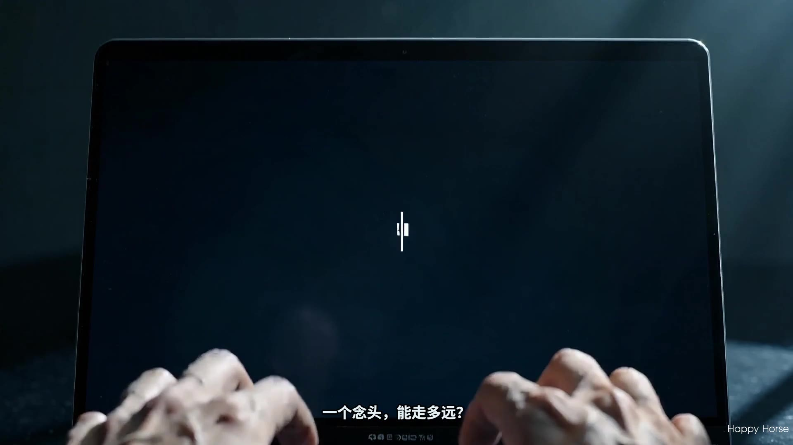

<p align="center">
  
</p>

<h1 align="center">Video Production Buddy / 织影</h1>

<p align="center"><strong>Open, governed AI video production: plan, approve, generate, compose, and verify before you spend.</strong></p>

<p align="center">
  <strong>English</strong> | <a href="README.zh-CN.md">简体中文</a>
</p>

<p align="center">
  <a href="#demos">🎬 Demos</a> &nbsp;·&nbsp;
  <a href="#why-it-is-different">✨ Why Different</a> &nbsp;·&nbsp;
  <a href="#how-it-works">🧭 How It Works</a> &nbsp;·&nbsp;
  <a href="#quick-start">⚡ Quick Start</a> &nbsp;·&nbsp;
  <a href="#capabilities">🧩 Capabilities</a> &nbsp;·&nbsp;
  <a href="#community-and-discussion">💬 Community</a> &nbsp;·&nbsp;
  <a href="#contributing">🤝 Contribute</a> &nbsp;·&nbsp;
  <a href="#citation">📚 Citation</a>
</p>

<p align="center">
  <a href="https://video-production-buddy.github.io"></a>
  <a href="LICENSE"></a>
</p>

<p align="center">
  
  
  
  
  
</p>

<p align="center">
  
</p>

---

> **Video Production Buddy / 织影** turns a general-purpose AI assistant into a governed video production studio. It does not treat video generation as a black-box prompt; it stages the work through brief refinement, research, proposal approval, asset generation, composition, and post-render checks.
>
> **Agent-first by design:** the AI assistant is the producer and orchestrator, while skills and Python tools handle concrete work such as provider routing, media analysis, generation, composition, validation, checkpointing, and cost tracking.
>
> <p align="center"><strong>⭐ Star this project if you want an open, inspectable alternative to black-box AI video generation, thank you!</strong></p>

## Demos

[](assets/readme/macbook_air.mp4)

> **MacBook Air ad** - "Please help me design an ad video for MacBook Air."

[](assets/readme/zhiying.mp4)

> **织影 product ad** - a guided assistant flow for intake, proposal gates, asset generation, composition, and final review before delivery.

## Why It Is Different

- 🎬 **Not prompt-to-video. Pipeline-to-video.** YAML manifests and director skills guide each stage from intake to publish.
- 💬 **Needs are discovered, not guessed.** Chat and GenUI gates help uncover the audience, taste, emotion, constraints, and ideal video profile in the user's mind.
- 🧠 **Design before asset generation.** Hot-topic search, Bilibili/Douyin-style viral analysis, professional video knowledge retrieval, and emotion-curve checks shape the plan while it is still cheap to revise.
- 🧷 **Consistency before generation.** Concept maps and approved constraints keep products, characters, scenes, and visual logic aligned across segments.
- 🛡️ **Hallucination review.** Review agents use policies and few-shot cases to catch unsafe, physically implausible, value-conflicting, or story-breaking samples before approval.
- ✅ **Human approval before expensive generation.** Briefs, proposals, scripts, scene plans, samples, and final renders can be reviewed before the next spend.
- 🔀 **Provider-aware execution.** Image, video, voice, music, stock, subtitle, analysis, and composition tools are discovered from the live registry and routed by task fit.
- 🧾 **Checkpointed and reproducible.** JSON artifacts, decision logs, and checkpoints preserve the production trail so work can be reviewed or resumed.
- 🧪 **Verified output.** Scene fidelity, product consistency, provider consistency, render validation, and post-render review keep the final video accountable to the approved brief.

| Typical AI video tools | Video Production Buddy / 织影 |
|------------------------|--------------------------------|
| One-shot prompt to generation | Staged pipeline from brief to verified render |
| The user must know exactly what to ask for | Chat and GenUI clarify needs before production decisions |
| Trend and reference work is optional | Hot topics and viral videos add timely audience context during design |
| Story quality is judged after rendering | Emotion pacing is reviewed in the lightweight text phase |
| Hidden provider and cost choices | Visible provider routing, budget checks, and approval gates |
| Segments can drift from each other | Concept maps constrain cross-segment consistency |
| Hard to resume or audit | Checkpointed artifacts and decision logs |
| Generate first, fix later | Approve the plan before expensive generation |
| Output judged by vibe only | Structured quality checks after composition |

## How It Works

```text
User request
  -> Chat and GenUI clarify needs, audience, taste, and constraints
  -> AI assistant selects a pipeline manifest
  -> AI assistant reads the stage director skill
  -> Design intelligence gathers trends, references, and production knowledge
  -> Python tools execute concrete media work
  -> JSON artifacts and checkpoints preserve state
  -> Review gates validate creative and technical decisions
  -> Composition runtime renders the final video
  -> Post-render checks verify the output
```

Video Production Buddy has no Python orchestrator. The assistant follows readable contracts in YAML manifests and Markdown skills. The codebase provides tools, schemas, persistence, validation, and render runtimes.

For ads and commercial-style projects, the pipeline adds stronger pre-production: product positioning, professional video production knowledge retrieval, hot-topic search, Bilibili/Douyin-style viral analysis, emotion pacing constraints, concept-map consistency checks, sample approval, scene fidelity checks, product identity validation, hallucination review, and final consistency review.

## Quick Start

### Happy Path

```bash
git clone https://github.com/video-production-buddy/video-production-buddy.git
cd video-production-buddy
make setup
python -m lib.agent_components install --profile default --frozen
make preflight
```

Then open the repository in your AI assistant and ask for a video. If preflight reports FFmpeg, Remotion, and the providers you need, you are ready to produce.

### Prerequisites

- **Python 3.10+** - [python.org](https://www.python.org/downloads/)
- **FFmpeg** - `brew install ffmpeg` / `sudo apt install ffmpeg` / `winget install FFmpeg` / [ffmpeg.org](https://ffmpeg.org/download.html)
- **Node.js 22+** - required for Remotion, HyperFrames and character-animation renders
- **An AI coding assistant** - Codex, Claude Code, Cursor, GitHub Copilot, Windsurf, or another assistant that can read files and run shell commands

Using a virtual environment is recommended:

```bash
python -m venv .venv
source .venv/bin/activate
```

On Windows PowerShell:

```powershell
python -m venv .venv
.\.venv\Scripts\Activate.ps1
```

### Install & Run

```bash
git clone https://github.com/video-production-buddy/video-production-buddy.git
cd video-production-buddy
make setup
python -m lib.agent_components install --profile default --frozen
```

`make setup` installs Python dependencies, installs the Remotion composer, installs Piper TTS when available, warms the HyperFrames `npx` cache when possible, and creates `.env` from `.env.example` if it does not already exist. The `lib.agent_components` command materializes the agent skill packs used by provider tools and runtime guidance.

If `make` is not available:

```bash
pip install -r requirements.txt
python -m lib.agent_components install --profile default --frozen
cd remotion-composer
npx --yes pnpm install --frozen-lockfile
cd ..
pip install piper-tts || echo "Piper TTS install skipped; offline narration may be unavailable"
npx --yes hyperframes --version || echo "HyperFrames cache warm skipped; run make hyperframes-doctor later"
test -f .env || cp .env.example .env
```

> **Windows note:** if Node package install fails with `ERR_INVALID_ARG_TYPE`, run the Remotion install step with `npx --yes pnpm install --frozen-lockfile` from inside `remotion-composer/`.

### Verify Setup

Run the preflight summary first:

```bash
make preflight
```

You should see JSON with `composition_runtimes` and provider availability. A healthy local setup should show FFmpeg and Remotion when FFmpeg, Node.js, and Remotion dependencies are installed. HyperFrames requires Node.js 22+, FFmpeg, and `npx`; validate it separately with:

```bash
make hyperframes-doctor
```

Docker warnings from the HyperFrames doctor are okay for local rendering; the important signal is that the command exits successfully and reports the runtime as available.

Then render the checked-in zero-key demo suite:

```bash
make demo
```

The demo path uses local Remotion components and should not require cloud API keys. It renders multiple demo videos, so allow several minutes on a normal laptop. Generated demo renders are written under `projects/demos/renders/`.

### Add API Keys

Every key is optional. Add only the providers you plan to use in `.env`:

```bash
# Free stock media
PEXELS_API_KEY=your-key
PIXABAY_API_KEY=your-key
UNSPLASH_ACCESS_KEY=your-key

# Image, video, voice, and music providers
FAL_KEY=your-key              # FLUX, Recraft, Seedance, Kling, Veo, MiniMax video
DASHSCOPE_API_KEY=your-key    # Qwen TTS/ASR, Wan video, Wanxiang image
GOOGLE_API_KEY=your-key       # Google Imagen + Google TTS
ELEVENLABS_API_KEY=your-key   # TTS, music, sound effects
OPENAI_API_KEY=your-key       # OpenAI TTS + image generation
XAI_API_KEY=your-key          # Grok image/video
HEYGEN_API_KEY=your-key       # Avatar and video gateway
RUNWAY_API_KEY=your-key       # Runway video
SUNO_API_KEY=your-key         # Music generation
MINIMAX_API_KEY=your-key      # Music generation
```

For the full provider list, pricing notes, and free-tier guidance, see [`docs/PROVIDERS.md`](docs/PROVIDERS.md).

Have an NVIDIA GPU and want local generation?

```bash
make install-gpu
```

Then set:

```bash
VIDEO_GEN_LOCAL_ENABLED=true
VIDEO_GEN_LOCAL_MODEL=wan2.1-1.3b
```

Other local model options include `wan2.1-14b`, `hunyuan-1.5`, `ltx2-local`, and `cogvideo-5b`.

### What Works With Zero API Keys?

Out of the box, the local path can still do useful work:

| Capability | Free/local tool | What it does |
|------------|-----------------|--------------|
| Narration | Piper TTS | Offline text-to-speech when installation succeeds. |
| Composition | Remotion | React-based animated scenes, title cards, charts, captions, and image motion. |
| Motion graphics | HyperFrames | HTML/CSS/GSAP video when Node.js 22+ and the runtime check pass. |
| Post-production | FFmpeg | Encoding, stitching, trimming, audio mixing, subtitle burn-in, and validation. |
| Demos | `make demo` | Renders the checked-in zero-key demo suite under `projects/demos/renders/`. |

For real production briefs, the assistant will present the preflight menu and tell you which providers are available, missing, or optional before spending on generation.

### Start With A Prompt

Open the repository in your AI assistant and ask for a video:

```text
Make a 30-second video ad for a new coffee brand.
Target audience: office workers who need a calm afternoon reset.
Platform: TikTok or Instagram Reels.
Style: warm, modern, cinematic, not loud.
```

The assistant should read `AGENT_GUIDE.md`, pick the right pipeline, inspect available tools, propose a plan, and wait for confirmation before major generation work.

Useful starter prompts:

```text
Make a 45-second animated explainer about why the sky is blue.
```

```text
Make a 75-second documentary montage about city life in the rain.
Use real footage only, no narration, elegiac tone, with music.
```

```text
Here is a reference video I like. Keep the pacing and hook style,
but turn it into a 30-second product ad for my own app.
```

## Capabilities

| Area | What It Supports |
|------|------------------|
| 🎞️ Generated video | Topic-to-video, explainers, animations, cinematic teasers, product ads, and short-form social videos. |
| 💬 Interactive discovery | Chat and GenUI interfaces clarify the target audience, emotion, constraints, and ideal video profile before generation. |
| 📣 Ad production | Strategy, hot-topic search, Bilibili/Douyin-style viral analysis, professional production knowledge retrieval, product constraints, sample approval, and publish checks. |
| 🎥 Source footage | Talking-head edits, screen demos, podcast repurposing, clip extraction, localization, and hybrid videos. |
| 🧭 Reference-aware planning | Analyze a reference video or user-provided source media before designing the new output. |
| 🎭 Story control | Emotion pacing constraints check suspense, twists, emotional anchors, and story appeal before assets are generated. |
| 🧩 Consistency control | Concept maps and approved design constraints keep product identity, characters, scenes, and visual logic consistent across segments. |
| 🔀 Provider routing | Select among configured image, video, voice, music, stock, subtitle, analysis, and composition tools. |
| 🧱 Composition | FFmpeg post-production, Remotion React video scenes, and HyperFrames HTML/CSS/GSAP motion graphics. |
| ✅ Quality gates | Schema validation, checkpointing, decision logs, provider consistency checks, hallucination review, scene fidelity checks, render validation, and post-render review. |

## Community and Discussion

Use the discussion path that matches what you need:

| Need | Best place |
|------|------------|
| Questions, ideas, roadmap topics, showcases | [GitHub Issues](https://github.com/video-production-buddy/video-production-buddy/issues) |
| Bugs, setup failures, missing provider docs | [GitHub Issues](https://github.com/video-production-buddy/video-production-buddy/issues) |
| Code, docs, examples, and provider/runtime fixes | [Pull requests](https://github.com/video-production-buddy/video-production-buddy/pulls) |

When reporting setup problems, include your OS, Python version, Node.js version, FFmpeg availability, the command you ran, and the relevant `make preflight` output.

## Contributing

Contributions are welcome when they keep the project inspectable, reproducible, and useful for real video production.

Good first contributions:

- Improve setup docs, provider notes, or error messages that blocked you.
- Add demo prompts, style playbooks, sample props, or small zero-key examples.
- Improve tests around schemas, pipeline manifests, provider routing, or render validation.
- Translate or tighten public-facing docs while keeping `README.md` and `README.zh-CN.md` synchronized.

Common developer paths:

- **Add a provider or tool:** put the implementation in the matching `tools/` capability package, inherit `BaseTool`, declare dependencies and `agent_skills`, let `tools/tool_registry.py` discover it, and add focused tests.
- **Add a pipeline:** create a manifest in `pipeline_defs/`, add stage director skills under `skills/pipelines/<pipeline-id>/`, reuse existing tools where possible, and add contract tests.
- **Add a demo or example:** prefer zero-key Remotion/FFmpeg paths when practical, keep generated outputs under `projects/`, and document the command needed to reproduce it.

Pull request checklist:

1. Start from a focused issue, discussion, or clearly scoped change.
2. Run the setup path in this README if your change affects install, runtime, providers, or demos.
3. Add or update focused tests for code, schema, manifest, or tool-contract changes.
4. Run `git diff --check -- README.md README.zh-CN.md` for README-only changes.
5. Run `make test-contracts` for manifest, schema, tool registry, pipeline, or agent-instruction changes.
6. In the PR, summarize the user-facing impact, list verification commands, and include screenshots or demo links for visual README changes.

## Architecture

| Path | Purpose |
|------|---------|
| `AGENT_GUIDE.md` | Operating contract for production agents. |
| `PROJECT_CONTEXT.md` | Shared architecture and development overview. |
| `pipeline_defs/` | Declarative video production pipelines. |
| `skills/` | Stage directors, creative guidance, review protocols, and workflow rules. |
| `tools/` | Provider tools, analysis tools, media processing, composition, validation, and cost tracking. |
| `schemas/` | Canonical artifact, checkpoint, pipeline, style, and tool contracts. |
| `project_profile/` | Project-local production conventions and current provider/runtime findings. |
| `projects/` | Generated project workspaces; ignored by git. |
| `remotion-composer/` | React/Remotion composition runtime. |

Useful local commands:

```bash
make preflight          # inspect configured provider/runtime availability
make demo               # render the checked-in zero-key demo suite
make demo-list          # list available demos
make hyperframes-doctor # validate the HyperFrames runtime
make test-contracts     # run contract tests
```

## Agent Instructions

This repository is meant to be operated by an AI coding assistant. If you are an agent:

1. Read [`AGENT_GUIDE.md`](AGENT_GUIDE.md) for production work.
2. Read [`PROJECT_CONTEXT.md`](PROJECT_CONTEXT.md) and [`docs/ARCHITECTURE.md`](docs/ARCHITECTURE.md) for development work.
3. Discover the live capability envelope before promising a production path:

   ```bash
   python -c "from tools.tool_registry import registry; import json; registry.discover(); print(json.dumps(registry.provider_menu_summary(), indent=2))"
   ```

4. For actual video production, follow the selected pipeline manifest in `pipeline_defs/` and the stage director skills in `skills/pipelines/`.
5. Do not spend on generation tools until the proposal and required approval gates are clear.

## Testing

```bash
# Contract tests
make test-contracts

# Full test suite
make test
```

## License

[GNU AGPLv3](LICENSE)

## Citation

If you find Video Production Buddy useful, please star and cite our project, thank you!

```bibtex
@software{shen2026videoproductionbuddy,
  title = {Video Production Buddy: An Interactive AI Video Production Assistant},
  author = {Shen, Zhouzhou and Chen, Yurun and Hu, Xueyu and Zhang, Shengyu},
  year = {2026},
  url = {https://github.com/video-production-buddy/video-production-buddy}
}
```

## Acknowledgements

Video Production Buddy is developed by the [AI4GC Lab](https://ai4gc.org/) at Zhejiang University.

Our code is based off the excellent [OpenMontage codebase](https://github.com/calesthio/OpenMontage).
